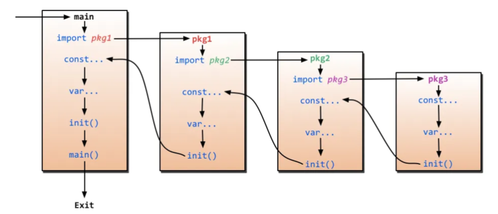

## func init()

This function will be run after global variable initilization and before main function running. You can think it as constructof of class in **C#** or **Java** language. 

You can see the below, how to `init()` will be triggered before the `main()` function and follow this order of execution

There are some rules of execution of `init()` function
- `init()` will run only once
- `init()` will run after global variable initilization of each package and before `main()` function
- `init()` will only run if the package is imported
- Multiple `init()` functions can be inside in a file. In this sutiation, it will run from top to the bottom.
- If there are multiple `init()` across **a package** (except `main`), it will run ascending alphabetical order from the file name.
- If there are multiple `init()` accros **multiple package** (except `main`), it will run ascending alphabetical order of the imported package
- If there are 3rd party libraries imported with `init()` inside, it follows the previous rule 

---
#### :warning: Downsides of `init()` usage:
- It slows down startup time
- `init()` function will be executed if you import the package whenever you needed or not
- Sometimes it will ruin unit tests. For example, if some global values are modified in `init()` function and it is not triggered on the test.
---
